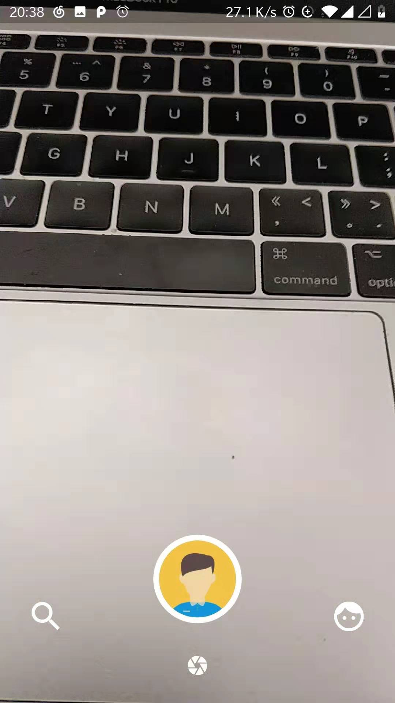

## Getting Started

1. cd server/ && virtualenv -p python3 venv && source venv/bin/activate &&  pip install -r requirements.txt && python main.py
2. modify `g/env.dart` `SERVER_URL` address，notice isn`t 127.0.0.1
3. cd projectPath && flutter packages get
4. cd projectPath && flutter run

### Preview

### Thanks

在整个页面布局上，也参考了一些网上资源，很感谢你们的奉献，帮助初学者(或后端～)可以快速写界面，此处不再一一列举。
最后这个项目也是第一次写，很感谢flutter的快速开发以及官方更新速度～，还有非常感谢官方文档，顺带学习到了很多移动开发知识，
如写的不好的地方，也请多担待，当然非常乐意接受指教～
